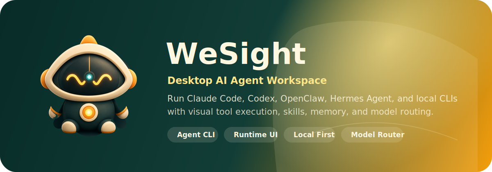
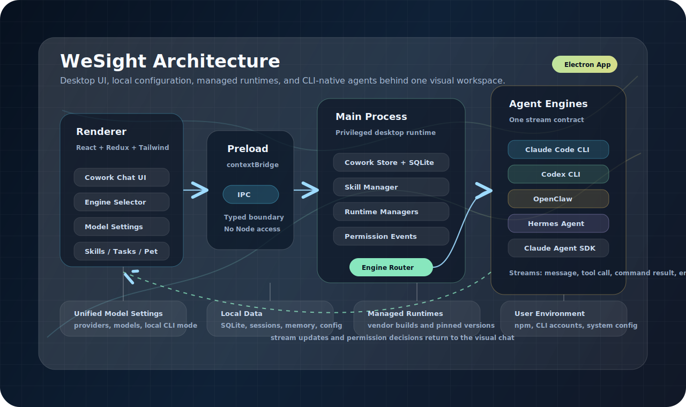

# WeSight

<p align="center">
  
</p>

<h3 align="center">
  把 Claude Code、Codex、OpenCode、Qwen Code、DeepSeek-TUI、OpenClaw、Hermes Agent 和自定义大模型统一到一个桌面 Agent 工作台
</h3>

<p align="center">
  <a href="https://github.com/freestylefly/wesight/stargazers"></a>
  <a href="https://github.com/freestylefly/wesight/network/members"></a>
  <a href="https://github.com/freestylefly/wesight/releases/latest"></a>
  <a href="LICENSE"></a>
  
</p>

<p align="center">
  <a href="README.md">English</a> | <strong>简体中文</strong>
</p>

> 早期公开版本优先提供 macOS Apple Silicon 安装包。如果 WeSight 对你的 Agent 工作流有帮助，欢迎点亮 Star，让更多开发者看到这个项目。

WeSight 是一个开源桌面 AI Agent 工作台。它把编码 Agent、本地 runtime、模型供应商、可视化工具执行、技能系统、定时任务和记忆系统整合到一个更完整的产品界面里。

## ⚡️ 项目愿景

WeSight 面向希望使用终端原生 Agent 能力，同时更偏好桌面化工作流的用户。它可以安装或复用 Claude Code、Codex、Hermes Agent、OpenCode、Qwen Code 和 DeepSeek-TUI，运行 WeSight 管理的 OpenClaw runtime，把统一模型设置映射到对应引擎，并用可视化 Chat 呈现工具面板、权限事件和长任务状态。

## 📖 快速入口

- 官网：[wesight.ai](https://wesight.ai/)
- 最新版本：[github.com/freestylefly/wesight/releases/latest](https://github.com/freestylefly/wesight/releases/latest)
- Agent 引擎：[Agent 引擎](#agent-引擎)
- 模型配置：[模型配置](#模型配置)
- 本地开发：[快速开始](#快速开始)
- 发布流程：[发布流程](#发布流程)

## 下载

公开桌面安装包通过 GitHub Releases 发布：

- 官网：[wesight.ai](https://wesight.ai/)
- 最新版本：[github.com/freestylefly/wesight/releases/latest](https://github.com/freestylefly/wesight/releases/latest)

早期公开版本优先提供 macOS Apple Silicon 安装包。Release assets 面向最终用户下载。CI artifacts 作为维护者测试构建产物的临时入口。

## 产品亮点

- **多 Agent 引擎统一入口**：支持 Claude Code、Codex、OpenCode、Qwen Code、DeepSeek-TUI、OpenClaw、Hermes Agent，以及内置 Claude Agent SDK runner。
- **一键安装和准备运行环境**：Claude Code / Codex / OpenCode / Qwen Code / DeepSeek-TUI CLI 在 macOS 上优先使用 npm 自动安装；Hermes Agent 使用 `curl -fsSL https://hermes-agent.nousresearch.com/install.sh | bash`；OpenClaw 由 WeSight 维护固定版本 runtime。
- **复用本机 CLI 登录态**：如果用户本机已经安装并登录 Claude Code、Codex、Hermes Agent、OpenCode、Qwen Code 或 DeepSeek-TUI，可以直接使用本机配置。
- **统一模型配置**：在 WeSight 设置里集中配置 OpenAI-compatible、Anthropic、DeepSeek、Qwen、Gemini、Moonshot、Ollama、OpenRouter、GitHub Copilot 和自定义供应商。
- **新手友好的模型映射**：选择跟随 WeSight 模型设置时，WeSight 会把模型信息映射到对应 Agent 引擎所需配置。
- **CLI Agent 图形化 Chat**：Claude Code、Codex、OpenCode、Qwen Code 和 DeepSeek-TUI 的运行过程会以桌面对话呈现，包含流式回复、工具调用、命令执行和结果面板。
- **任务内快速切换引擎**：新建任务时可选择引擎，Chat 右上角也可以快速切换适合当前任务的引擎。
- **权限门控**：文件访问、Shell 命令、敏感工具调用都会通过可见事件呈现，方便用户确认和追踪。
- **Slash 指令面板**：在输入框输入 `/` 可以呼出模型、上下文、状态、配置、技能、记忆等指令入口。
- **内置技能系统**：支持 Web 搜索、Office 文档、表格、PPT、PDF、Playwright 自动化、视频生成、邮件、股票研究等技能。
- **定时任务**：可以通过对话或 GUI 创建周期性 Agent 任务，如研究报告、新闻摘要、邮箱整理、自动提醒。
- **记忆系统**：自动提取用户偏好和长期信息，跨会话延续个人化上下文。
- **桌面宠物**：在设置-外观中开启桌面宠物，支持动画、移动和简单互动。

## Agent 引擎

| 引擎                  | 适合场景                                     | 准备方式                                |
| --------------------- | -------------------------------------------- | --------------------------------------- |
| 内置 Claude Agent SDK | 通用 Cowork 任务、技能执行、本地工具调用     | WeSight 内置                            |
| Claude Code           | Claude Code 编码工作流的图形化使用           | macOS 一键安装 CLI，或复用本机 CLI 配置 |
| Codex                 | Codex CLI 编码工作流的图形化使用             | macOS 一键安装 CLI，或复用本机 CLI 配置 |
| OpenCode              | OpenCode CLI 工作流和模型供应商路由          | macOS 一键安装 CLI，或复用本机 CLI 配置 |
| Qwen Code             | Qwen Code CLI 工作流和通义千问友好配置       | macOS 一键安装 CLI，或复用本机 CLI 配置 |
| DeepSeek-TUI          | DeepSeek-TUI HTTP/SSE runtime 和工具流式渲染 | macOS 一键安装 CLI，或复用本机 CLI 配置 |
| OpenClaw              | 沙箱式 Agent runtime、gateway 集成、隔离执行 | WeSight 固定版本 runtime                |
| Hermes Agent          | 本地 Hermes Agent runtime 实验和集成         | 官方 install.sh、`hermes setup`，或复用本机 CLI 配置 |

## 模型配置

WeSight 提供统一的模型设置层，尽量把复杂的 CLI 配置收进图形化界面。

- 可以添加多个供应商和多个模型。
- 可以启用或停用某个供应商。
- 可以为 Claude Code / Codex / Hermes Agent / OpenCode / Qwen Code / DeepSeek-TUI 选择“跟随 WeSight 模型设置”。
- 可以为 Claude Code / Codex / Hermes Agent / OpenCode / Qwen Code / DeepSeek-TUI 选择“使用本机 CLI 配置”。
- 可以配置任意 OpenAI-compatible 接口，用于本地模型、私有模型服务或第三方 API。

这样新手可以少接触终端配置，高级用户也能保留本机已有 Agent 环境。

## 快速开始

### 环境要求

- Node.js `>=24 <25`
- npm

### 本地开发

```bash
git clone https://github.com/freestylefly/wesight.git
cd wesight
npm install
npm run electron:dev
```

开发服务器默认运行在 `http://localhost:5175`。

### 带 Agent runtime 启动

```bash
# 构建或复用固定版本 OpenClaw runtime，然后启动 WeSight
npm run electron:dev:openclaw

# 启动 WeSight；Hermes Agent 会从用户本机 CLI 检测，也可以在设置中安装
npm run electron:dev:hermes
```

常用 OpenClaw 环境变量：

```bash
# 指定 OpenClaw 源码路径
OPENCLAW_SRC=/path/to/openclaw npm run electron:dev:openclaw

# 强制重建 OpenClaw runtime
OPENCLAW_FORCE_BUILD=1 npm run electron:dev:openclaw

# 本地开发 OpenClaw 时跳过版本切换
OPENCLAW_SKIP_ENSURE=1 npm run electron:dev:openclaw
```

## 构建

```bash
# TypeScript + Vite + Electron bundle
npm run build

# ESLint
npm run lint
```

## 打包

```bash
# macOS
npm run dist:mac
npm run dist:mac:x64
npm run dist:mac:arm64
npm run dist:mac:universal

# Windows
npm run dist:win

# Linux
npm run dist:linux
```

托管 runtime 版本在 `package.json` 里声明：

- `openclaw.version`

Windows 安装包可以内置便携 Python runtime，用于 Python 类技能。OpenClaw 生成目录位于 `vendor/`，该目录已加入 Git 忽略。Hermes Agent 使用用户默认的本机 CLI 环境。

## 发布流程

WeSight 使用 GitHub Releases 分发桌面安装包。

1. 将准备发布的改动提交到 `main`。
2. 创建并推送版本 tag，例如：

```bash
git tag v2026.4.8-alpha.1
git push origin v2026.4.8-alpha.1
```

3. `Build Platforms` workflow 会构建 macOS Apple Silicon 安装包。
4. 构建产物会先上传为 workflow artifacts，方便临时测试。
5. workflow 会创建一个 draft GitHub Release，并附上 `.dmg` 安装包。
6. 在 GitHub 上检查草稿说明和安装包，确认后发布 Release。

官网的下载按钮可以指向 latest release 地址，让用户始终进入最新公开版本。

## 架构概览

WeSight 使用 Electron 进程隔离架构。Renderer 不直接访问 Node.js 能力，所有高权限操作都通过 preload bridge 和 main process IPC 完成。

<p align="center">
  
</p>

### Main Process

- 窗口生命周期和托盘
- SQLite 本地持久化
- Agent 引擎路由
- Claude Code / Codex / OpenCode / Qwen Code / DeepSeek-TUI 外部引擎 adapter
- OpenClaw runtime 和 Hermes 本机 CLI/gateway 管理
- 技能加载和服务管理
- 定时任务引擎
- IM gateway 和通知集成

### Renderer

- React + Redux Toolkit + Tailwind CSS
- Cowork Chat UI
- Agent 引擎选择器和模型选择器
- 设置、技能、定时任务、Agent、MCP、外观界面
- 消息、工具调用、命令输出、Slash 指令面板的流式渲染

### 关键目录

```text
src/main/
  main.ts                         Electron 入口和 IPC handlers
  preload.ts                      安全桥接
  sqliteStore.ts                  本地持久化
  coworkStore.ts                  会话和消息存储
  libs/agentEngine/               引擎 adapter 和 router
  libs/openclawEngineManager.ts   OpenClaw runtime 生命周期
  libs/hermesEngineManager.ts     Hermes 本机 CLI 和 gateway 生命周期
  libs/externalAgent*.ts          Claude Code / Codex / Hermes Agent / OpenCode / Qwen Code / DeepSeek-TUI CLI 安装与配置辅助
  im/                             IM gateway 集成

src/renderer/
  App.tsx                         应用外壳
  components/cowork/              Chat、引擎选择、模型选择、会话 UI
  components/Settings.tsx         模型、引擎、外观、技能、记忆和应用设置
  components/pet/                 桌面宠物 UI
  services/                       IPC wrapper 和应用服务
  store/slices/                   Redux 状态

SKILLs/                           内置技能
scripts/                          runtime、打包和安装脚本
src/shared/                       共享常量和类型
```

## 内置技能

WeSight 内置了一组覆盖日常 Agent 工作的技能：

| 方向       | 示例                                                     |
| ---------- | -------------------------------------------------------- |
| 研究       | Web 搜索、科技新闻、股票研究、影视/音乐搜索              |
| 文档       | DOCX、XLSX、PPTX、PDF 处理                               |
| 自动化     | Playwright、本地工具、定时任务                           |
| 创作       | Remotion 视频、前端设计、Canvas 设计、Seedream、Seedance |
| 通信       | IMAP/SMTP 邮件                                           |
| Agent 构建 | Skill 创建、Skill 审查、自定义规划                       |

技能可以在桌面 UI 中启用、停用和路由。

## 安全设计

- Renderer 开启 context isolation。
- Renderer 禁用 Node integration。
- 高权限动作统一经过 main process IPC。
- 工具执行过程可展示权限确认事件。
- 本地数据存储在应用数据目录中的 SQLite。
- runtime、构建产物和本地密钥文件已加入 Git 忽略。

## Roadmap Ideas

- 更多 Agent 引擎 adapter 和 runtime profile
- 更完整的模型迁移和 provider 导入
- 可分享的任务模板
- 更丰富的 Slash 指令结果
- 长任务可视化检查工具
- 社区技能插件市场

## Star 趋势图

[](https://star-history.com/#freestylefly/wesight&Date)

## 公众号

微信搜索 **苍何** 或扫描下方二维码关注苍何的原创公众号，回复 **AI** 获取更多 AI 提示词与 Agent 工作流资料。

<p align="center">
  
</p>

## 开源协议

MIT. See [LICENSE](LICENSE).
